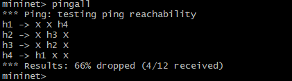
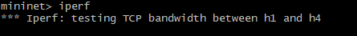
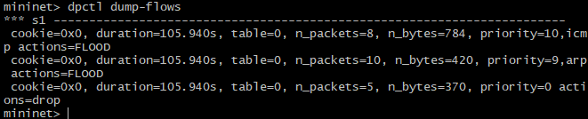
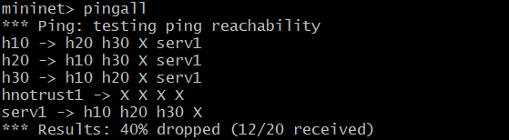
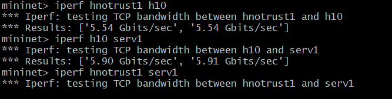
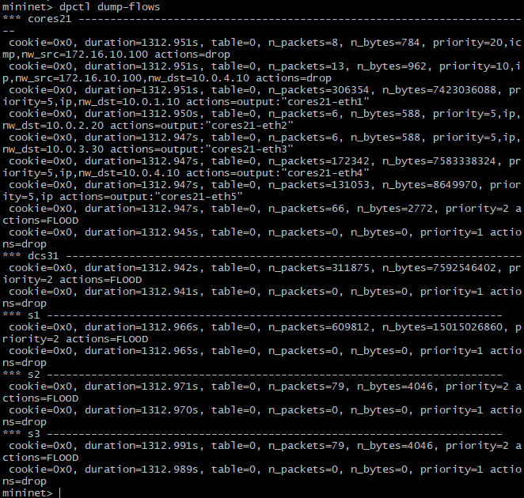

# Firewall Implementation based on SDN
   

## Description
**Firewall** Implementation based on Software Defined Networking **(SDN)** using **OpenFlow** controller, In this implementation, I am using  **[POX](https://github.com/noxrepo/pox)** as OpenFlow controller that developed in Python.
## Getting Started
### Dependencies
Dependencies are listed in `requirements.txt` file. \
but i am using `mininet Version2.3.0` which is accessible from [here](https://github.com/mininet/mininet/releases/download/2.3.0/mininet-2.3.0-210211-ubuntu-20.04.1-legacy-server-amd64-ovf.zip).
### Part2 Result
for part2 result of executing commands are shown below:
1. `pingall` command. that host No.1 and host No.4 can ping each other as well as host No.2 and host No.3 .

   

2. `iperf` command. command will hang cause we blocked IP traffic.


   

3. `dpctl dump-flows` command. for showing switche flow table rules.


   
### Part3 Result
for part3 result of executing commands are shown below:
1. `pingall` command. that untrusted host can not ping non of hosts.


   

2. `iperf` command. that untrusted host can not send traffic to server and command will hang.



   

3. `dpctl dump-flows` command. for showing switches flow table rules.





# 🧰 **Step-by-Step Installation & Running Guide**

## **1️⃣ Clone the Repository**

```bash
cd ~
git clone https://github.com/ameerezae/SDN-Firewall.git
cd SDN-Firewall
```

This will give you the project files and folders such as:
`463_mininet/topos`, `pox`, `doc`, etc.

---

## **2️⃣ Install Mininet**

If Mininet is not installed yet, you can install it via **apt** or from **source**.

### **Option 1: Install via apt (Ubuntu)**

```bash
sudo apt update
sudo apt install mininet
```

### **Option 2: Install from source (latest/specific version)**

```bash
git clone https://github.com/mininet/mininet
cd mininet
sudo ./util/install.sh -a
```

Confirm installation:

```bash
mn --version
```

---

## **3️⃣ Install POX Controller**

POX Repository: [https://github.com/noxrepo/pox](https://github.com/noxrepo/pox)

```bash
cd ~
git clone https://github.com/noxrepo/pox.git
cd pox
```

> ⚙️ Keep note of this directory — you’ll launch the POX controller from here.

---

## **4️⃣ Install Python Dependencies**

Navigate back to your **SDN-Firewall** directory and install dependencies:

```bash
cd ~/SDN-Firewall
sudo pip install -r requirements.txt
```

> 💡 If the project uses Python 2, ensure you use `pip2` or a virtual environment with Python 2.

---

## **5️⃣ Configure Topology & POX Modules**

* Mininet topology scripts are located in:
  `463_mininet/topos/`
* POX modules are located in:
  `pox/`

Determine which topology you want to run (e.g., `part2`, `part3`, etc.) as described in the project README.

You may modify **firewall rules** depending on your experiment.
The README explains expected behavior for `pingall`, `iperf`, and `dpctl`.

---

## **6️⃣ Launch POX Controller**

From the POX directory:

```bash
cd ~/pox
sudo ./pox.py log.level --DEBUG misc.firewall
```

> 🔁 Replace `misc.firewall` with the correct module name from this project.
> 🧠 Use `sudo` if required — POX might need privileged ports.

---

## **7️⃣ Launch Mininet Topology**

Open **another terminal** and run:

```bash
sudo python ~/SDN-Firewall/463_mininet/topos/<topo_script.py>
```

> Replace `<topo_script.py>` with the desired file (e.g., `part2.py`).

Inside the **Mininet CLI**, run commands like:

```bash
pingall
iperf
dpctl dump-flows
```

These commands help verify the expected network behavior (e.g., trusted hosts can ping, untrusted cannot).

---

## **8️⃣ Validate Output**

In **Mininet CLI**:

* Run `pingall` → check that connectivity matches expected behavior.
* Use `iperf` → verify that blocked traffic is actually blocked.
* Use `dpctl dump-flows` → inspect the flow tables on switches.

The project README provides sample output and screenshots for reference.

---

## **9️⃣ Cleanup / Stop**

Once you’re done:

* Inside Mininet CLI, type `exit`.
* Terminate the POX controller.

Optionally, run a cleanup script (if provided) or manually flush flows.

---


   
